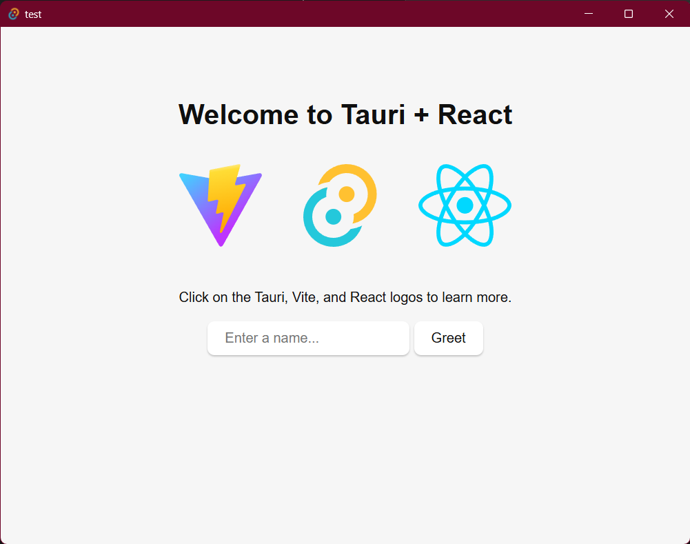
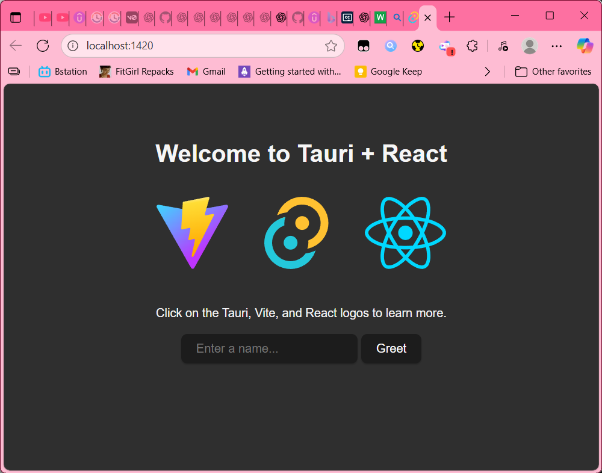

# TAURI ITU APASIH

Tauri itu framework untuk membuat aplikasi dekstop & mobile **native multiplatfom** ringan.
Tauri bisa di-_integrate_ dengan framework frontend apa saja asal framework-nya nge-compile **(HTML, CSS, JS)** dan disaat yang sama juga memaksimalkan bahasa seperti **Rust, Swift, Kotlin** untuk backend-nya.

Tapi sebelum inisialisasi tentu aja ada _prerequisites_-nya dulu.

---

## ✅ Prerequisites

### All Platform

- Node.js 18+
- Rust toolchain via [rustup](https://rustup.rs)
- Cargo (sudah otomatis ada setelah install Rust)

### Windows

- Visual Studio C++ Build Tools (workload _Desktop development with C++_ + Windows 10/11 SDK)
- [WebView2 Runtime](https://developer.microsoft.com/en-us/microsoft-edge/webview2/)

### macOS

- Xcode Command Line Tools (`xcode-select --install`)

### Linux

- WebKitGTK + build dependencies (lihat [docs Tauri Linux](https://tauri.app/v2/guides/getting-started/prerequisites/#linux))

---

_disclaimer_ : Tauri yang digunakan disini **Tauri V2** ya. untuk v1 kalian bisa langsung liat [Tauri V1](https://v1.tauri.app/)

## 🚀 Mulai Build

Kalau semuanya sudah dicek dan aman, waktunya buat project baru, btw disini yang aku praktekin itu frontnednya React + TypeScript ya

```bash
npm create tauri-app@latest my-app

? Project name (tauri-app) › (Isi aja bebas asal sopan)

? Identifier (com.f.(nama project kamu)) > com.f.(nama project kamu)

? Choose which language to use for your frontend ›
❯ TypeScript / JavaScript  (pnpm, yarn, npm, deno, bun)
  Rust
  .NET

? Choose your package manager ›
❯ npm
  pnpm
  yarn
  deno
  bun

Choose your UI template ›
  Vanilla
  Vue
  Svelte
> React
  Solid
  Angular
  Preact

? Choose your UI flavor ›
❯ TypeScript
  JavaScript
```

Nah projectnya sudah jadi, nanti muncul notice ini dari Tauri-nya:

```bash
For Desktop development, run:
  npm run tauri dev

For Android development, run:
  npm run tauri android dev
```

_disclaimer 2_ : di project ini package managernya kita pake npm ya, jadi kalau kalian semisal pakai pnpm, yarn, bun, dll bisa di sesuaikan saja

Nah project nya iya memang sudah ada, tapi coba kalian buka file App.tsx di /src
Kalau masih banyak error biasanya karena _dependencies_ belum ter-install, tapi buat jaga-jaga coba cek ada error TS/import, sapa tau
miss (tapi gamungkin sih kan belum ganti apa2 di codenya hehe)

```bash
npm install
```

^ _didalem folder projectnya ya_

Nah setelah itu kalau model sudah terinstall semua nanti error-nya hilang semua tuh,
langsung aja kita

```bash
npm run tauri dev
```

nanti di layar kalian akan muncul window seperti ini ya:



kalian juga biasanya bisa langsung akses websitenya:



urlnya dikasih tau di terminal ya, bisa kalian lihat di terminal:

```bash
npm run tauri dev

VITE v7.1.7  ready in 345 ms

  ➜  Local:   http://localhost:1420/

*rest of the message*
```

nah karena ini baru perkenalan jadi ga banyak yang harus di notice
kalau sudah terbiasa dengan react harusnya aman saja

tapi mungkin ada yang baru aja masuk rust seperti saya, langsung saja
buka folder /src-tauri

nanti didalamnya strukturnya itu biasanya seperti ini:

```bash
/capabilities
/gen/
/icons
/src/lib.rs
/src/main.rs
/target
build.rs
Cargo.lock
Cargo.toml
tauri.conf.json
```

untuk kode yang bisa di notice ada di /src/lib.rs

```rust
#[cfg_attr(mobile, tauri::mobile_entry_point)]
pub fn run() {
    tauri::Builder::default()
        .plugin(tauri_plugin_opener::init())
        .invoke_handler(tauri::generate_handler![greet])
        .run(tauri::generate_context!())
        .expect("error while running tauri application");
}
```

codeblock ini nantinya bisa dikembangkan jika kalian mau porting ke android juga.
kalian juga bisa pindahkan ini ke main.rs

jadi nanti di lib.rs nya seperti ini:

```rust
#[tauri::command]
fn greet(name: &str) -> String {
    format!("Hello, {}! You've been greeted from Rust!", name)
}
```

dan main.rs dari yang seperti ini:

```rust
#![cfg_attr(not(debug_assertions), windows_subsystem = "windows")]

fn main() {
    tauri_app_lib::run()
}
```

jadi seperti ini:

```rust
#![cfg_attr(not(debug_assertions), windows_subsystem = "windows")]

fn main() {
    tauri::Builder::default()
        .plugin(tauri_plugin_opener::init())
        .invoke_handler(tauri::generate_handler![greet])
        .run(tauri::generate_context!())
        .expect("error while running tauri application");
}
```

selesai deh,
btw kalo kalian penasaran folder2 dan file itu gunanya apa,
aku jelasin ya...

- ```/src``` : Tempat kode rust (entry point ```lib.rs``` & ```main.rs```). Di sini kamu bisa bikin command ```Rust```, setup, plugin, dll.

- ```/capabilities``` : folder configurasi permission (ngatur command boleh akses sampai level apa, misal filesystem, network, dsb). Biar lebih aman dan ketahuan aja gitu.

- ```/gen``` : dari framework ```Tauri```, jadi abaikan saja dulu

- ```/icons``` : ikon aplikasi yang bakal dipake pas bundling buat windows, linux, dan macos

- ```/target``` : build output ```Rust``` (otomatis dibuat oleh ```Cargo```)

- ```Cargo.toml``` : File config ```Rust``` project. Mirip ```package.json``` Node.js.

- ```Cargo.lock``` : File lock dependency ```Rust```, jangan disentuh ya

- ```build.rs``` : Script build opsional. Biasa dipakai Tauri buat bundle icon, resource, dll

- ```tauri.conf.json``` : File config utama Tauri: nama app, identifier, window default, bundling, updater, dsb

singkatnya : 
  - ```Rust``` side diatur lewat ```Cargo.toml```, ```lib.rs```, ```main.rs```.
  - ```Tauri``` side diatur lewat ```tauri.conf.json``` + ```/capabilities```
  - ```Assets``` side ada di icons
  - Sisanya kayak (```gen```, ```target```, ```Cargo.lock```) lebih ke teknis build system.

tambahan
Cargo ini itu kayak package manager & build tool tapi untuk ```Rust``` mirip kaya ```npm``` di JS atau ```pip``` di ```Python```.
Fungsinya buat install dependency, compile project, dan run/test app.

kalian juga bisa coba2 command cargo di /src-tauri
```bash
cd src-tauri/

terus

cargo build   # compile project
cargo run     # jalanin project
cargo check   # cek error tanpa build penuh
cargo clean   # hapus folder build (target/)
```